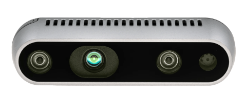

# Intel RealSense D435 Depth Camera



**Role in MyBot:** RGB-D camera providing color and depth streams for future object tracking (OpenCV chapter). Streams at 640×480@15fps via the RSUSB backend.

---

## Specs

| Parameter | Value |
|---|---|
| Model | Intel RealSense D435 |
| Depth technology | Active IR stereo |
| Depth range | 0.1m – ~10m |
| Depth resolution | up to 1280×720 |
| Depth frame rate | up to 90 fps |
| RGB resolution | 1920×1080 |
| RGB frame rate | up to 30 fps |
| **MyBot stream config** | **640×480 @ 15fps (color + depth)** |
| Field of view (depth) | 87° × 58° × 95° (H×V×D) |
| Field of view (RGB) | 69° × 42° × 77° |
| Interface | **USB 3.2 Gen 1** |
| USB ID | `8086:0b07` |
| Power | ~900mW (USB) |
| Dimensions | 90 × 25 × 25 mm |
| Weight | 72g |
| FW version (MyBot) | 5.17.0.10 |
| Serial (MyBot) | 244622071235 |

---

## Connection

```
RealSense D435
    └── USB 3.2 Gen 1 cable
            └── Raspberry Pi USB 3.0 port
```

> ⚠️ **Must use USB 3.0 port on Pi.** USB 2.0 bandwidth is insufficient for simultaneous color + depth streams.

---

## ⚠️ RSUSB backend required

The apt-installed `ros-humble-librealsense2` is compiled against the kernel UVC driver. On the Pi, `xioctl(UVCIOC_CTRL_QUERY)` calls time out, preventing the color stream from retrieving intrinsics. **Depth works but color fails** with the default apt install.

**Solution:** librealsense v2.56.4 built from source with `-DFORCE_RSUSB_BACKEND=ON`.

See full build procedure: [`docs/realsense-rsusb-setup.md`](../../docs/realsense-rsusb-setup.md)

### Why this version specifically

The apt `ros-humble-realsense2-camera` package links against `librealsense2.so.2.56` (SONAME). The source build must match this exactly — use tag `v2.56.4`, not the latest release.

### Key step (after build)

```bash
sudo cp /usr/local/lib/librealsense2.so.2.56.4 \
        /opt/ros/humble/lib/aarch64-linux-gnu/librealsense2.so.2.56.4
```

`LD_LIBRARY_PATH` tricks do not work — ROS `setup.bash` prepends `/opt/ros/humble/lib/aarch64-linux-gnu` and overrides ldconfig.

---

## ROS 2 launch

```bash
# Included in launch_robot.launch.py — launched automatically via mybot-launch
# Stand-alone test:
ros2 launch articubot_one camera.launch.py
```

**Topics:**

| Topic | Type | Rate |
|---|---|---|
| `/camera/camera/color/image_raw` | `sensor_msgs/Image` | 15 fps |
| `/camera/camera/depth/image_rect_raw` | `sensor_msgs/Image` | 15 fps |

---

## Verify

```bash
ros2 topic hz /camera/camera/color/image_raw      # expect ~15 Hz
ros2 topic hz /camera/camera/depth/image_rect_raw # expect ~15 Hz
```

In RViz2: Add **Image** → topic `/camera/camera/color/image_raw` — should show live color feed.

---

## ⚠️ Replug after reboot

The D435 sometimes fails to enumerate on USB after a Pi reboot. If topics are not publishing after launch:

```bash
# Unplug and replug the USB cable physically
# Then relaunch:
mybot-launch
```

---

## udev rule (already installed)

```
/etc/udev/rules.d/99-realsense-libusb.rules
```

Contains entry for `0b07` (D435 USB product ID). Reload if camera is not detected:

```bash
sudo udevadm control --reload-rules && sudo udevadm trigger
```

---

## Official docs

- Product page: https://www.intelrealsense.com/depth-camera-d435/
- librealsense GitHub: https://github.com/IntelRealSense/librealsense
- ROS 2 wrapper: https://github.com/IntelRealSense/realsense-ros
- Datasheet: https://www.intelrealsense.com/wp-content/uploads/2020/06/Intel-RealSense-D400-Series-Datasheet-June-2019.pdf
