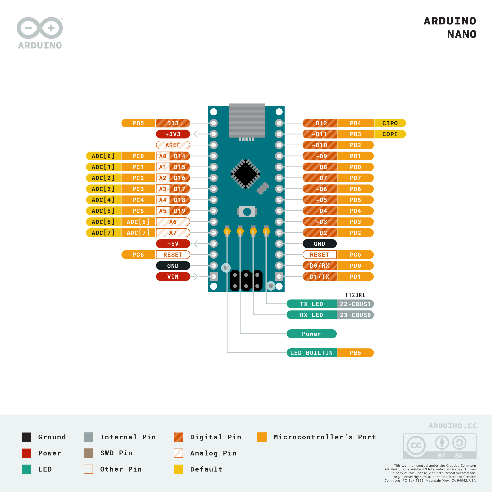

# Arduino Nano



**Role in MyBot:** Motor controller. Runs `legacy/ros_arduino_bridge` firmware — receives closed-loop speed commands from `ros2_control` over serial, drives the TB6612 motor driver, and reads quadrature encoders.

> **Migration note:** Will be replaced by the ESP32-S3 in `feature/esp32-microros`.

---

## Specs

| Parameter | Value |
|---|---|
| Microcontroller | ATmega328P |
| Clock | 16 MHz |
| Flash | 32 KB (2 KB bootloader) |
| SRAM | 2 KB |
| EEPROM | 1 KB |
| Operating voltage | 5V |
| Digital I/O | 14 pins (6 PWM capable) |
| Analog inputs | 8 (A0–A7) |
| PWM pins | D3, D5, D6, D9, D10, D11 |
| UART | D0 (RX), D1 (TX) |
| I2C | A4 (SDA), A5 (SCL) |
| SPI | D10 (SS), D11 (MOSI), D12 (MISO), D13 (SCK) |
| Max current per I/O pin | 40 mA |
| USB chip | CH340 (clone boards) |
| Dimensions | 18 × 45 mm |

---

## Pinout

```
                    Arduino Nano
              ┌─────────────────────┐
         D13 ─┤ SCK          TX  D1 ├─ to Pi UART RX (serial comms)
         D12 ─┤ MISO         RX  D0 ├─ to Pi UART TX (serial comms)
     Right B ─┤ D11          RST    ├─
         D10 ─┤ SS(PWMB) A7/D7 D2 ├─ Left encoder A  (INT0)
  RIGHT motor ─┤ D9(BIN2)    A6 D3 ├─ Right encoder A (INT1, PWM)
  RIGHT motor ─┤ D8(BIN1)    5V    ├─ (power to TB6612 VCC)
  RIGHT motor ─┤ D7(AIN1)   RST    ├─
  RIGHT motor ─┤ D6(AIN2)   GND    ├─
  RIGHT motor ─┤ D5(PWMA)   VIN    ├─
         GND ─┤ GND         A3  D17├─
      Left B ─┤ D4          A2  D16├─
         D3 ─┤ (RightA)    A1  D15├─
         D2 ─┤ (Left A)    A0  D14├─
         5V ─┤ 5V          AREF   ├─
        3.3V ─┤ 3.3V       A7  D21├─
         RST ─┤ RST        A6  D20├─
              └─────────────────────┘
```

---

## MyBot pin assignments

### Motor driver (TB6612)

| Arduino Pin | TB6612 Pin | Function |
|---|---|---|
| D5 | PWMA | RIGHT motor speed (PWM) |
| D6 | AIN2 | RIGHT motor direction B |
| D7 | AIN1 | RIGHT motor direction A |
| D8 | BIN1 | LEFT motor direction A |
| D9 | BIN2 | LEFT motor direction B |
| D10 | PWMB | LEFT motor speed (PWM) |
| 5V | VCC | TB6612 logic supply |

### Encoders

| Arduino Pin | Signal | Note |
|---|---|---|
| D2 | Left encoder A | INT0 — hardware interrupt |
| D4 | Left encoder B | |
| D3 | Right encoder A | INT1 — hardware interrupt |
| D12 | Right encoder B | |

### Serial (to Raspberry Pi)

| Arduino Pin | Connection |
|---|---|
| D0 (RX) | Pi UART TX |
| D1 (TX) | Pi UART RX |
| GND | Common ground |

In practice, the Nano connects to the Pi via USB (CH340 → `/dev/arduino`) — the USB cable carries both power and serial data. No separate UART wiring needed.

---

## Firmware

**Firmware:** `legacy/ros_arduino_bridge` (modified)
**File:** `legacy/ros_arduino_bridge/ROSArduinoBridge/`
**Firmware define:** `TB6612_MOTOR_DRIVER`

### Serial protocol (57600 baud, carriage-return terminated)

| Command | Description |
|---|---|
| `e` | Read encoder counts |
| `r` | Reset encoders |
| `o <PWM1> <PWM2>` | Raw PWM (−255 to 255) |
| `m <Spd1> <Spd2>` | Closed-loop speed (rad/s) |
| `p <Kp> <Kd> <Ki> <Ko>` | Update PID gains |

### Validated PID gains

| Gain | Value |
|---|---|
| Kp | 20 |
| Kd | 12 |
| Ki | 0 |
| Ko | 50 |

---

## Flash command

```bash
# On Pi — kill serial port first
sudo fuser -k /dev/arduino

/home/ryan/bin/arduino-cli compile \
  --fqbn arduino:avr:nano:cpu=atmega328old \
  ~/mybot_ws/legacy/ros_arduino_bridge/ROSArduinoBridge

/home/ryan/bin/arduino-cli upload \
  --fqbn arduino:avr:nano:cpu=atmega328old \
  --port /dev/ttyUSB0 \
  ~/mybot_ws/legacy/ros_arduino_bridge/ROSArduinoBridge
```

FQBN uses `atmega328old` (old bootloader variant, common on clone Nano boards).

---

## Power

- Powered via USB from Raspberry Pi (5V, ~50mA idle)
- No separate power supply needed
- 5V pin on Nano supplies TB6612 VCC (logic only — motors draw from 12V VM line)

---

## Official docs

- Pinout: https://content.arduino.cc/assets/Pinout-NANO_latest.png
- Product page: https://store.arduino.cc/products/arduino-nano
- ATmega328P datasheet: https://ww1.microchip.com/downloads/en/DeviceDoc/Atmel-7810-Automotive-Microcontrollers-ATmega328P_Datasheet.pdf
