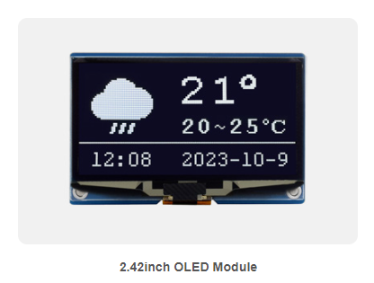

# Waveshare 2.42inch OLED Module



**Role in MyBot:** Robot status dashboard mounted on the chassis — shows battery voltage, velocity, estimated pose, and connection state at a glance without needing a laptop.

---

## Specs

| Parameter | Value |
|---|---|
| Display size | 2.42 inch diagonal |
| Resolution | 128 × 64 pixels |
| Controller IC | Solomon SSD1309 |
| Display color | White (also available: yellow) |
| Interface | SPI (default from factory) or I2C (resistor swap) |
| Connector | MX1.25 7-pin |
| Logic voltage | 3.3V or 5V (onboard XC6206 regulator → 3.3V to SSD1309) |
| Active display area | 55.01 × 27.49 mm |
| Module dimensions | 61.50 × 39.50 mm |
| Pixel size | 0.4 × 0.4 mm |

---

## Pin Descriptions (MX1.25 7-pin connector)

| Pin | Name | Function |
|---|---|---|
| 1 | VCC | Power input — 3.3V or 5V |
| 2 | GND | Ground |
| 3 | DIN | SPI: MOSI data in / I2C: SDA |
| 4 | CLK | SPI: SCLK clock / I2C: SCL |
| 5 | CS | SPI: chip select (active LOW) / I2C: tie to GND |
| 6 | DC | SPI: data/command select / I2C: address select (LOW=0x3C, HIGH=0x3D) |
| 7 | RST | Hardware reset (active LOW) — can tie to VCC if software reset not needed |

---

## Interface Selection

The module ships in **4-wire SPI mode** by default — use it as-is. No resistor swap needed.

| Mode | Resistor position | Notes |
|---|---|---|
| **SPI (default)** | R1, R4 populated | DIN=MOSI, CLK=SCLK, CS and DC active — **use this** |
| I2C | R2, R3 populated | requires PCB resistor swap |

---

## MyBot Wiring — Raspberry Pi, SPI mode

The Pi's SPI0 bus is unused. The display plugs in directly with no resistor changes.

| Module Pin | Wire Color | Signal | Raspberry Pi (BCM) | Pi Board Pin |
|---|---|---|---|---|
| VCC | Red | 3.3V | 3.3V | 1 |
| GND | Black | GND | GND | 6 |
| DIN | Blue | MOSI | GPIO10 / SPI0_MOSI | 19 |
| CLK | Yellow | SCLK | GPIO11 / SPI0_SCLK | 23 |
| CS | Orange | CE0 | GPIO8 / SPI0_CE0 | 24 |
| DC | Green | Data/Cmd | GPIO25 | 22 |
| RST | White | Reset | GPIO27 | 13 |

**Enable SPI on Pi (one-time):**
```bash
sudo raspi-config   # Interface Options → SPI → Enable
```

**Verify:**
```bash
ls /dev/spidev*   # should show /dev/spidev0.0
```

---

## Software — Raspberry Pi

The SSD1309 is register-compatible with the SSD1306 but requires explicit driver selection. The `luma.oled` Python library has native SSD1309 support.

**Install:**
```bash
sudo apt-get install -y python3-gpiozero   # pulls in lgpio — required on Ubuntu 22.04
sudo pip3 install luma.oled pillow
```

> **Ubuntu 22.04 note:** `python3-gpiozero` (which installs `lgpio`) is required. RPi.GPIO does not work on Jammy; without it, luma.oled initialises without error but the display shows nothing.

**Minimal test:**
```python
from luma.core.interface.serial import spi
from luma.oled.device import ssd1309
from luma.core.render import canvas

serial = spi(device=0, port=0, gpio_DC=25, gpio_RST=27)
device = ssd1309(serial)

with canvas(device) as draw:
    draw.text((0, 0), "MyBot online", fill="white")
```

**ROS 2 integration:** write a Python node that subscribes to `/battery_state`, `/diff_cont/odom`, and `/odom`, then renders to the display using Pillow. See `docs/oled-display-plan.md` for the full plan.

---

## Official docs

- Waveshare wiki: https://www.waveshare.com/wiki/2.42inch_OLED_Module
- Waveshare product page: https://www.waveshare.com/2.42inch-oled-module.htm
- SSD1309 datasheet: https://www.solomon-systech.com/product/ssd1309/
- luma.oled library: https://luma-oled.readthedocs.io/
