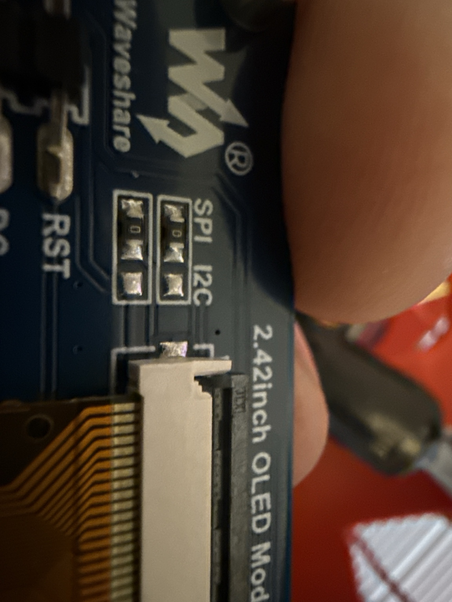

# Waveshare 2.42inch OLED Module


**Role in MyBot:** Robot status dashboard mounted on the chassis — shows battery voltage, velocity, estimated pose, and connection state at a glance without needing a laptop.

---

## Specs

| Parameter | Value |
|---|---|
| Display size | 2.42 inch diagonal |
| Resolution | 128 × 64 pixels |
| Controller IC | Solomon SSD1309 |
| Display color | White (also available: yellow) |
| Interface | SPI (default from factory) or I2C (resistor swap) |
| Connector | MX1.25 7-pin |
| Logic voltage | 3.3V or 5V (onboard XC6206 regulator → 3.3V to SSD1309) |
| Active display area | 55.01 × 27.49 mm |
| Module dimensions | 61.50 × 39.50 mm |
| Pixel size | 0.4 × 0.4 mm |

---

## Pin Descriptions (MX1.25 7-pin connector)

| Pin | Name | Function |
|---|---|---|
| 1 | VCC | Power input — 3.3V or 5V |
| 2 | GND | Ground |
| 3 | DIN | SPI: MOSI data in / I2C: SDA |
| 4 | CLK | SPI: SCLK clock / I2C: SCL |
| 5 | CS | SPI: chip select (active LOW) / I2C: tie to GND |
| 6 | DC | SPI: data/command select / I2C: address select (LOW=0x3C, HIGH=0x3D) |
| 7 | RST | Hardware reset (active LOW) — can tie to VCC if software reset not needed |

---

## Interface Selection

The module ships in **4-wire SPI mode** by default — use it as-is. No resistor swap needed.

| Mode | Resistor position | Notes |
|---|---|---|
| **SPI (default)** | R1, R4 populated | DIN=MOSI, CLK=SCLK, CS and DC active — **use this** |
| I2C | R2, R3 populated | requires PCB resistor swap |

**Verify before wiring:** flip the board over and check the two 3-pad selector groups near the "SPI I2C" label. Each group should have a 0-ohm resistor bridging the **left two pads** (the pads closer to the "SPI" text). The right pad of each group should be empty.



---

## MyBot Wiring — Raspberry Pi, SPI mode

The Pi's SPI0 bus is unused. The display plugs in directly with no resistor changes.

| Module Pin | Wire Color | Signal | Raspberry Pi (BCM) | Pi Board Pin |
|---|---|---|---|---|
| VCC | Red | 3.3V | 3.3V | 1 |
| GND | Black | GND | GND | 6 |
| DIN | Blue | MOSI | GPIO10 / SPI0_MOSI | 19 |
| CLK | Yellow | SCLK | GPIO11 / SPI0_SCLK | 23 |
| CS | Orange | CE0 | GPIO8 / SPI0_CE0 | 24 |
| DC | Green | Data/Cmd | GPIO25 | 22 |
| RST | White | Reset | GPIO27 | 13 |

**Enable SPI on Pi (one-time):**
```bash
sudo raspi-config   # Interface Options → SPI → Enable
```

**Verify:**
```bash
ls /dev/spidev*   # should show /dev/spidev0.0
```

---

## Software — Raspberry Pi

**Install:**
```bash
sudo pip3 install spidev pillow
# RPi.GPIO is already available on Ubuntu 22.04 via python3-rpi.gpio
```

> **Do NOT use luma.oled for SSD1309.** luma.oled's `ssd1309` class is an alias for `ssd1306` — it sends the SSD1306 charge pump command (`0x8D 0x14`) which is undefined on SSD1309 and corrupts initialization. Use spidev + RPi.GPIO directly.

**Minimal test:**
```python
import RPi.GPIO as GPIO, spidev, time

DC, RST = 25, 27
GPIO.setwarnings(False); GPIO.setmode(GPIO.BCM)
GPIO.setup(DC, GPIO.OUT); GPIO.setup(RST, GPIO.OUT)

sp = spidev.SpiDev(); sp.open(0, 0)
sp.max_speed_hz = 1000000; sp.mode = 0b11

def cmd(c): GPIO.output(DC, GPIO.LOW); sp.writebytes([c])

GPIO.output(RST, GPIO.HIGH); time.sleep(0.1)
GPIO.output(RST, GPIO.LOW);  time.sleep(0.1)
GPIO.output(RST, GPIO.HIGH); time.sleep(0.1)

for c in [0xAE, 0x00, 0x10, 0x20, 0x00, 0xFF, 0xA6,
          0xA8, 0x3F, 0xD3, 0x00, 0xD5, 0x80,
          0xD9, 0x22, 0xDA, 0x12, 0xDB, 0x40]:
    cmd(c)
time.sleep(0.1); cmd(0xAF)

# Fill all pixels ON
for page in range(8):
    cmd(0xB0 + page); cmd(0x00); cmd(0x10)
    GPIO.output(DC, GPIO.HIGH); sp.writebytes([0xFF] * 128)
```

**ROS 2 integration:** `oled_display_node.py` uses this same spidev approach plus Pillow for layout rendering. Black pixels (`fill=0`) in PIL appear lit on the display; white pixels are off.

The node runs as a systemd service (`oled-display.service`) that starts at boot and restarts automatically. See the live setup docs in `README.md`, `docs/pi-setup.md`, and `HARDWARE_MEMORY.md` for the current layout and boot behavior. `docs/oled-display-plan.md` is now archived notes only.

---

## Official docs

- Waveshare wiki: https://www.waveshare.com/wiki/2.42inch_OLED_Module
- Waveshare product page: https://www.waveshare.com/2.42inch-oled-module.htm
- SSD1309 datasheet: https://www.solomon-systech.com/product/ssd1309/
- luma.oled library: https://luma-oled.readthedocs.io/
