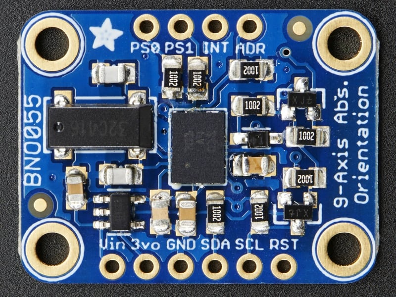

# Adafruit BNO055 Absolute Orientation Sensor



**Role in MyBot:** 9-DOF IMU providing fused orientation data. Publishes `/imu/imu` (angular velocity + linear acceleration) consumed by `robot_localization` EKF for odometry fusion.

---

## Specs

| Parameter | Value |
|---|---|
| IC | Bosch BNO055 |
| Sensors | 3-axis accelerometer, gyroscope, magnetometer |
| Fusion mode | NDOF (onboard Cortex-M0 handles sensor fusion) |
| Output | Euler angles, quaternions, angular velocity, linear accel, gravity vector, temperature |
| Orientation update rate | 100 Hz |
| Interface | I2C (or UART) |
| I2C addresses | 0x28 (default, ADR low) / 0x29 (ADR high) |
| Logic voltage | 3.3V – 5V (onboard level shifter) |
| Vin | 3.3V – 5.0V |
| Dimensions | 20 × 27 mm |
| Weight | 3g |

---

## Pinout


| Pin | Description |
|---|---|
| VIN | Power input 3.3–5V |
| 3VO | 3.3V output (~50mA available) |
| GND | Ground |
| SDA | I2C data (onboard 10kΩ pullup, 3V/5V compatible) |
| SCL | I2C clock (onboard 10kΩ pullup, 3V/5V compatible) |
| RST | Hardware reset (pull low then high) |
| INT | Interrupt output (3V logic) |
| ADR | Address select: float/low = 0x28, high = 0x29 |
| PS0, PS1 | Mode select — leave unconnected for I2C |

---

## MyBot wiring — Raspberry Pi

| BNO055 Pin | Raspberry Pi | Note |
|---|---|---|
| VIN | 3.3V (pin 1) | Adafruit board has onboard regulator |
| GND | GND (pin 6) | |
| SDA | GPIO2 / SDA1 (pin 3) | I2C bus 1 |
| SCL | GPIO3 / SCL1 (pin 5) | I2C bus 1 |
| ADR | — | Leave unconnected → address 0x28 |
| RST, INT, PS0, PS1 | — | Leave unconnected |

Physical mount: `xyz="0.004 -0.018 0.055"` in base_link frame
(80mm from front edge, 50mm from right edge, upper deck)

## MyBot wiring — ESP32-S3 (feature branch)

| BNO055 Pin | ESP32 GPIO | Note |
|---|---|---|
| VIN | 3V3 | |
| GND | GND | |
| SDA | GPIO8 | Confirmed working on bench |
| SCL | GPIO9 | GPIO22 not exposed on DevKitC-1 |
| ADR | — | Leave unconnected → 0x28 |

Shares I2C bus with INA219 (addr 0x40) — both confirmed simultaneously on bench.

---

## ROS 2 configuration

**Config file:** `src/articubot_one/config/bno055_params.yaml`

```yaml
bno055:
  ros__parameters:
    connection_type: i2c
    i2c_bus: 1
    i2c_addr: 0x28
    topic_prefix: "imu/"
    frame_id: "imu_link"
    operation_mode: 0x0C   # NDOF — full sensor fusion
```

**Topic:** `/imu/imu` (`sensor_msgs/Imu`)

**EKF config** (`ekf.yaml`):
- Orientation: **disabled** (magnetometer unreliable on metal chassis)
- Angular velocity: enabled
- Linear acceleration: enabled

---

## Verify on Pi

```bash
sudo i2cdetect -y 1           # confirm 0x28 present
ros2 topic echo /imu/imu      # check data flowing
ros2 topic echo /imu/calib_status   # 0–3 per sensor; 3 = fully calibrated
```

**Calibration:** move sensor in a figure-8 pattern until `S3 G3 A3 M3`.

---

## Official docs

- Adafruit product page: https://www.adafruit.com/product/2472
- Adafruit learn guide: https://learn.adafruit.com/adafruit-bno055-absolute-orientation-sensor
- BNO055 datasheet: https://cdn-shop.adafruit.com/datasheets/BST_BNO055_DS000_12.pdf
- ROS 2 driver: https://github.com/flynneva/bno055
