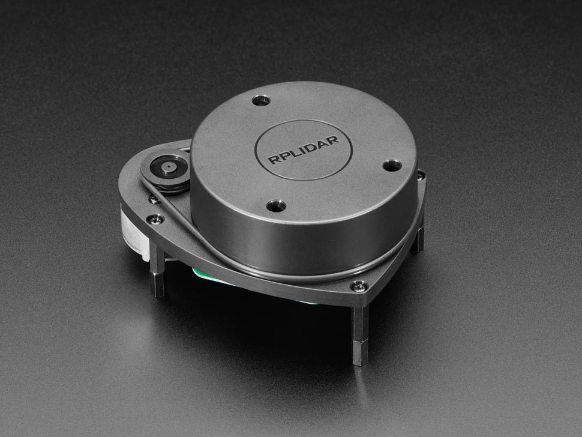

# Slamtec RPLidar A1 M8



**Role in MyBot:** 360° 2D laser scanner. Provides `/scan` topic consumed by `slam_toolbox` for mapping and Nav2 AMCL for localization.

---

## Specs

| Parameter | Value |
|---|---|
| Model | RPLidar A1 M8 |
| Scan range | 0.15m – 12m |
| Scan rate | 1–10 Hz (typical 5.5 Hz) |
| Sample rate | up to 8000 samples/sec |
| Angular resolution | ~1° (360 samples per scan at 5.5Hz) |
| Interface | UART (via USB adapter) |
| Baud rate | **115200** |
| USB adapter chip | CP2102 |
| Power | 5V, ~400mA (via USB) |
| Laser class | Class 1 (eye-safe) |
| Laser wavelength | 785nm |
| Weight | ~170g |
| Dimensions | 98.5 × 70 × 60 mm (with motor) |

---

## Connection

```
RPLidar A1
    │
    └── USB adapter (CP2102)
            │
            └── Raspberry Pi USB 2.0
                    /dev/rplidar  (udev symlink)
```

**udev rule:** `/etc/udev/rules.d/99-mybot.rules`
```
SUBSYSTEM=="tty", ATTRS{idVendor}=="10c4", ATTRS{idProduct}=="ea60", SYMLINK+="rplidar"
```

---

## ⚠️ Known issue: baud rate must be explicit

The RPLidar node will **timeout silently** if `serial_baudrate` is not set explicitly in the launch file. The default in some versions of the ROS driver is incorrect.

**Fix already applied** in `src/articubot_one/launch/rplidar.launch.py`:
```python
serial_port = '/dev/rplidar'
serial_baudrate = 115200   # must be explicit
```

---

## ROS 2 launch

```bash
# Included in launch_robot.launch.py — launched automatically via mybot-launch
# Stand-alone test:
ros2 launch articubot_one rplidar.launch.py
```

**Topic:** `/scan` (`sensor_msgs/LaserScan`)

---

## SLAM / Nav2 config values

| Parameter | Value | Set in |
|---|---|---|
| `laser_max_range` | `12.0` | `mapper_params_online_async.yaml` |
| `laser_max_range` | `12.0` | `nav2_params.yaml` |

---

## Physical mount

- Mounted on top deck, centered laterally (y=0)
- URDF: `xyz="0.040 0.0 0.116"` in chassis frame (40mm from front after 180° chassis flip)
- Laser scan plane: 116mm from ground

---

## Verify

```bash
ls /dev/rplidar                         # confirm udev symlink
ros2 topic hz /scan                     # expect ~5.5 Hz
ros2 topic echo /scan --once            # check range data
```

In RViz2: add **LaserScan** → topic `/scan`, Fixed Frame `base_link` — should show 360° ring of points.

---

## Stale process issue

If the Pi was not shut down cleanly, a stale process may hold `/dev/rplidar` and cause a crash on relaunch.

```bash
sudo fuser -k /dev/rplidar
```

The `mybot-launch` alias does this automatically before launching.

---

## Official docs

- Product page: https://www.slamtec.com/en/lidar/a1
- SDK & ROS driver: https://github.com/Slamtec/rplidar_ros
- ROS 2 package: `ros-humble-rplidar-ros`
