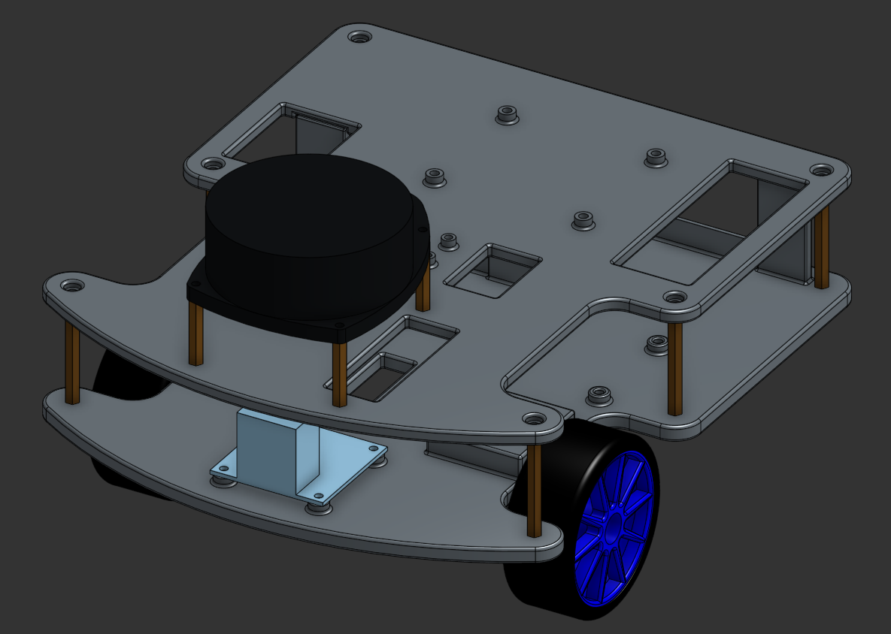
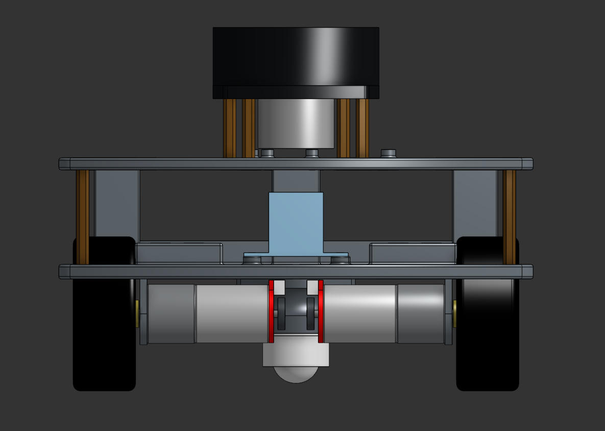
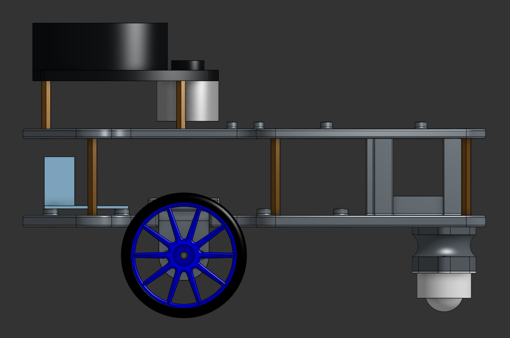
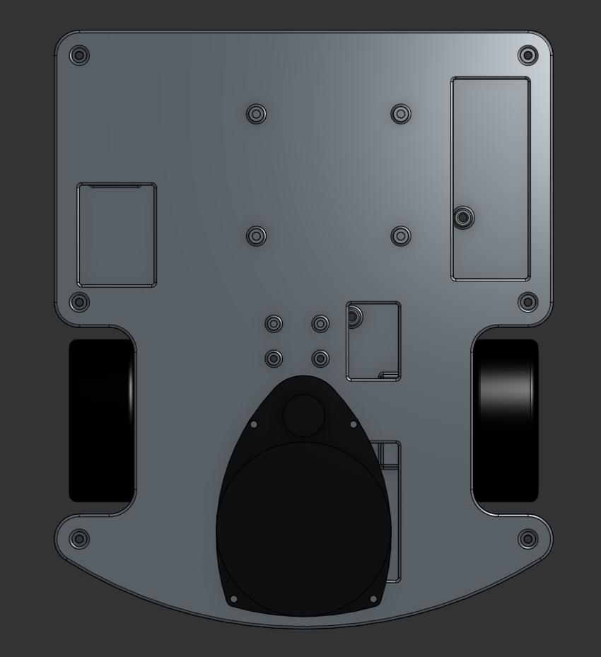

# MyBot

**Autonomous differential drive robot built on ROS 2 Humble** — Nav2 navigation, RPLidar SLAM, BNO055 IMU fusion, Intel RealSense D435 depth camera, and an in-progress ESP32-S3 + micro-ROS migration replacing the Arduino Nano.

[](https://docs.ros.org/en/humble/)
[](https://www.raspberrypi.com/)
[](https://docs.espressif.com/projects/esp-idf/en/latest/esp32s3/)
[](https://platformio.org/)
[](LICENSE)

Based on the [Articulated Robotics](https://articulatedrobotics.xyz/category/build-a-mobile-robot-with-ros/) tutorial series.

---

## Robot

<p align="center">
  
</p>

<p align="center">
  
  
  
</p>

> Real robot photos coming. The renders above are from CAD. See `Hardware/mybot/` for orthographic views.

---

## Status

| Feature | State |
|---|---|
| Differential drive + encoders | ✅ working |
| RPLidar A1 SLAM | ✅ working — map saved |
| BNO055 IMU + EKF fusion | ✅ working |
| Nav2 autonomous navigation | ✅ working |
| Intel RealSense D435 (color + depth) | ✅ working — RSUSB backend |
| INA219 battery monitor | ✅ working (Pi I2C, temporary) |
| ESP32-S3 micro-ROS migration | 🔄 in progress — BNO055/INA219 confirmed, motors pending |
| Object tracking (OpenCV) | ⬜ pending |

---

## Hardware

| Component | Part | Notes |
|---|---|---|
| SBC | Raspberry Pi 4 | Ubuntu 22.04, ROS 2 Humble |
| Motor controller (current) | Arduino Nano | powered via Pi USB; ros_arduino_bridge firmware |
| Motor controller (target) | ESP32-S3-DevKitC-1 | micro-ROS, WiFi OTA; powered via Pi USB |
| Motor driver | Adafruit TB6612FNG | replaces L298N |
| Motors | JGA25-371 DC12V 130RPM | 45:1 gear ratio, 11 PPR encoder |
| Lidar | RPLidar A1 M8 | 12m range, 360° |
| IMU | Adafruit BNO055 | I2C, NDOF fusion mode |
| Camera | Intel RealSense D435 | USB 3.2, libusb/RSUSB backend |
| Power monitor | Adafruit INA219 | I2C, publishes `/battery_state` |
| Power distribution | DFRobot DFR0205 | DC-DC buck converter, 3.6–25V in, 5A/25W |

**Chassis:** custom differential drive, 240×200mm, dual-deck. Wheel separation 179mm, wheel radius 34mm.

### Power architecture

```
12V battery
├── DFR0205 5V regulated ──→ Raspberry Pi (USB-C)
│       └── Pi USB ────────→ Arduino Nano  (power + serial)
│       └── Pi USB ────────→ ESP32-S3      (power + serial, when in use)
└── DFR0205 12V passthrough → TB6612 VM   (motor power only)
```

---

## Architecture

Two-machine split: the Pi runs hardware drivers, a dev machine runs computation and navigation.

```
Dev machine (Ubuntu 22.04)
  ├── ekf_filter_node        fuses /diff_cont/odom + /imu/imu → /odom
  ├── map_server + amcl      localization against saved map
  ├── Nav2 stack             global planner, controller, recovery
  └── rviz2

        ↕ ROS 2 DDS (same LAN, ROS_DOMAIN_ID=0)

Raspberry Pi 4
  ├── robot_state_publisher
  ├── ros2_control_node + diff_cont + joint_broad
  ├── twist_mux
  ├── rplidar_composition    /scan
  ├── bno055                 /imu/imu
  ├── realsense2_camera      /camera/camera/{color,depth}/...
  └── ina219_node            /battery_state

        ↕ USB serial @ 57600

Arduino Nano (ros_arduino_bridge)
  └── closed-loop PID, TB6612 motor driver, quadrature encoders
```

### ESP32 migration (branch: `feature/esp32-microros`)

The ESP32-S3 will replace both the Arduino Nano and Pi-side BNO055/INA219 I2C nodes. The Pi-side EKF, Nav2, and AMCL stack require **zero changes** — the ESP32 publishes identical topics over micro-ROS.

```
Raspberry Pi 4
  └── micro_ros_agent (serial, /dev/ttyUSB0)

        ↕ UART @ 115200

ESP32-S3
  ├── encoders + PID → /diff_cont/odom
  ├── BNO055 (I2C GPIO8/9) → /imu/imu
  ├── INA219 (I2C GPIO8/9) → /battery_state
  └── subscribes /diff_cont/cmd_vel_unstamped
```

---

## Software Dependencies

### ROS 2 stack (Pi + dev machine)

- ROS 2 Humble (Ubuntu 22.04)
- `ros2_control`, `diff_drive_controller`, `joint_state_broadcaster`
- `ros-humble-rplidar-ros`
- `ros-humble-bno055`
- `ros-humble-robot-localization`
- `ros-humble-navigation2`, `ros-humble-nav2-bringup`
- `ros-humble-realsense2-camera`, `ros-humble-realsense2-description`
- librealsense v2.56.4 built from source with `-DFORCE_RSUSB_BACKEND=ON` (see [setup guide](docs/realsense-rsusb-setup.md))

### ESP32 firmware

- [PlatformIO](https://platformio.org/) (VS Code extension or CLI)
- micro-ROS for Arduino (Humble)
- Adafruit BNO055 library
- Adafruit INA219 library

---

## Getting Started

### 1. Clone

```bash
git clone https://github.com/Dasovon/MyBot.git
cd MyBot
```

For ESP32 development, check out the feature branch:

```bash
git checkout feature/esp32-microros
```

### 2. Pi workspace setup

```bash
# On the Pi (Ubuntu 22.04 + ROS 2 Humble already installed)
mkdir -p ~/mybot_ws/src && cd ~/mybot_ws/src
git clone https://github.com/Dasovon/MyBot.git articubot_one
git clone -b humble https://github.com/joshnewans/diffdrive_arduino.git
git clone -b newans_ros2 https://github.com/joshnewans/serial.git
cd ~/mybot_ws
rosdep install --from-paths src --ignore-src -r -y
colcon build --symlink-install
source install/setup.bash
```

### 3. Dev machine workspace setup

```bash
mkdir -p ~/dev_ws/src && cd ~/dev_ws/src
git clone https://github.com/Dasovon/MyBot.git articubot_one
cd ~/dev_ws
sudo apt install -y ros-humble-robot-localization ros-humble-navigation2 \
  ros-humble-nav2-bringup ros-humble-realsense2-camera-msgs ros-humble-realsense2-description
source /opt/ros/humble/setup.bash
colcon build --symlink-install
```

### 4. ESP32 firmware setup

Install PlatformIO, then create `credentials.h` (gitignored — never commit):

```cpp
// src/esp32_microros/test/<sketch>/src/credentials.h
#pragma once
#define WIFI_SSID     "your-ssid"
#define WIFI_PASSWORD "your-password"
#define OTA_PASSWORD  "esp32ota"
```

**First flash (USB):**

```bash
cd src/esp32_microros/test/test_bno055   # or test_encoders, test_motors, test_microros
pio run -e esp32-s3 --target upload
```

If upload fails: hold the BOOT button, click Upload, release when "Connecting..." appears.

**All future flashes (OTA, WiFi):**

```bash
pio run -e esp32-s3-ota --target upload
```

**Wireless serial monitor:**

```bash
nc esp32-mybot.local 23        # Linux / macOS / Git Bash
# or: telnet esp32-mybot.local
# or: PuTTY → Raw mode, port 23 (Windows)
```

For Windows-specific one-time setup (CH340 driver, VS Code, PlatformIO), see [CLAUDE.md — Windows ESP32 dev setup](CLAUDE.md#windows-esp32-dev-setup-one-time).

---

## Usage

### Full autonomous navigation stack

```bash
# Terminal 1 — Pi: hardware drivers
ssh ryan@mybot "source ~/mybot_ws/install/setup.bash && ros2 launch articubot_one launch_robot.launch.py"

# Terminal 2 — Dev: EKF
ros2 launch articubot_one dev_launch.py

# Terminal 3 — Dev: localization (AMCL + map server)
ros2 launch articubot_one localization_launch.py

# Terminal 4 — Dev: Nav2
ros2 launch articubot_one navigation_launch.py

# Terminal 5 — Dev: RViz2
rviz2
```

In RViz2:
1. Set **Fixed Frame** to `map`
2. Add: **Map** (`/map`, Durability: Transient Local), **LaserScan** (`/scan`), **RobotModel**
3. Use **2D Pose Estimate** to initialize AMCL (click robot location, drag heading arrow)
4. Use **Nav2 Goal** to send an autonomous navigation target

### Teleoperation

```bash
ros2 run teleop_twist_keyboard teleop_twist_keyboard
```

### Monitoring

```bash
# IMU
ros2 topic echo /imu/imu
ros2 topic echo /imu/calib_status    # 0–3 per axis; 3 = fully calibrated

# Odometry
ros2 topic echo /odom                # EKF-filtered
ros2 topic echo /diff_cont/odom      # raw wheel odometry

# Battery
ros2 topic echo /battery_state

# Camera streams
ros2 topic hz /camera/camera/color/image_raw
ros2 topic hz /camera/camera/depth/image_rect_raw

# Emergency stop
ros2 topic pub --once /cmd_vel geometry_msgs/msg/Twist '{}'
```

---

## Project Structure

```
MyBot/
├── src/
│   ├── articubot_one/          # Main ROS 2 package
│   │   ├── launch/             # All launch files
│   │   ├── config/             # Nav2, EKF, controller, SLAM params
│   │   ├── description/        # URDF / xacro robot model
│   │   └── docs/               # Hardware and workflow docs
│   ├── esp32_microros/         # ESP32 + micro-ROS firmware (feature branch)
│   │   ├── src/main.cpp        # Full combined firmware
│   │   └── test/               # Incremental test sketches
│   │       ├── test_bno055/    # I2C IMU verification ✅
│   │       ├── test_encoders/  # Quadrature encoder test
│   │       ├── test_motors/    # TB6612 motor test
│   │       └── test_microros/  # micro-ROS transport test
│   ├── diffdrive_arduino/      # ros2_control plugin  [branch: humble]
│   ├── serial/                 # Serial library  [branch: newans_ros2]
│   └── ros_arduino_bridge/     # Arduino firmware (current production path)
├── Hardware/                   # CAD renders and motor datasheets
└── docs/
    ├── workflow.md             # Full launch sequence + emergency stop
    ├── pin-mapping.md          # Arduino and ESP32 wiring tables
    └── realsense-rsusb-setup.md
```

---

## Pin Reference

See [`docs/pin-mapping.md`](docs/pin-mapping.md) for full tables. Key assignments:

**TB6612 → Arduino Nano (current stack)**

| TB6612 | Arduino | |
|---|---|---|
| PWMA | D5 | RIGHT speed |
| AIN1/AIN2 | D7/D6 | RIGHT direction |
| PWMB | D10 | LEFT speed |
| BIN1/BIN2 | D8/D9 | LEFT direction |

**ESP32-S3 (feature branch)**

| Function | GPIO |
|---|---|
| RIGHT speed (PWMA) | 25 |
| LEFT speed (PWMB) | 14 |
| BNO055 + INA219 SDA | 8 |
| BNO055 + INA219 SCL | 9 |
| Left encoder A/B | 36 / 39 |
| Right encoder A/B | 34 / 35 |

---

## Docs

| File | Contents |
|---|---|
| [`CLAUDE.md`](CLAUDE.md) | Full project state, fix history, config values, Windows setup |
| [`docs/workflow.md`](docs/workflow.md) | Launch sequence, emergency stop, end-of-session routine |
| [`docs/pin-mapping.md`](docs/pin-mapping.md) | Complete wiring tables for Arduino and ESP32 |
| [`docs/realsense-rsusb-setup.md`](docs/realsense-rsusb-setup.md) | RealSense RSUSB backend build procedure |
| [`HARDWARE_MEMORY.md`](HARDWARE_MEMORY.md) | Hardware block diagram, wiring notes |

---

## License

MIT — see [LICENSE](LICENSE).
